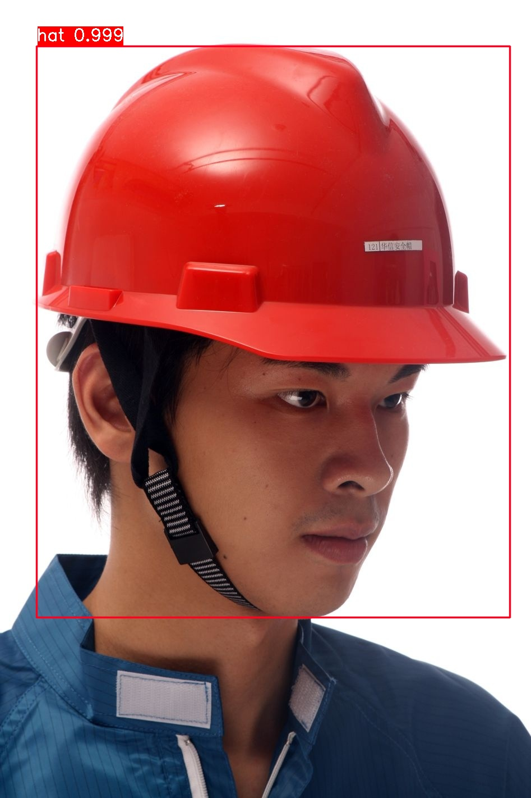

## RetinaNet 安全帽目标检测

**Xu Jing**

### 0.模型准备


（1）模型依赖库安装：

```
pip3 install numpy --user
pip3 install . --user
```

安装过程中，会检查依赖库，比如opencv-python，如果没有安装，会加载并安装。这里提一句，如果在安装时某个包下载安装不成功，自己记下来版本，比如opencv-python 3.4.5.20，可以直接先去利用pip或conda安装，但是一定要记得对应的版本。

（2）模型编译：

```
python3 setup.py build_ext --inplace
```

<!-- 编译的时候可能会出现提示，没有某个版本C++的编译器，我提示的时没有2014版，把错误提示直接百度，就会出现解决方法，我是下载了一个3M的14版的编译工具。（当然，最好就是有相应版本的完整C++） -->

以上两个步骤不知道有没有先后顺序，我是先安装然后编译的。安装是为了解决后面运行的时候，会提示import keras_retinanet 出错。编译是因为模型中cython部分，需要预编译。


### 1.个人训练数据准备

我们仍然使用**安全帽识别**的训练集，关于该数据集的详细介绍请参考：<https://github.com/DataXujing/YOLO-V3-Tensorflow>

(1) 将xml数据转化为csv数据

运行`python3 01_xml2csv.py` 和 `python3 02_train_label_fix_rename.py`,把xml数据转化成train_label_fix的样式：

```
filename,X1,Y1,X2,Y2,X3,Y3,X4,Y4,type
000015983ee24b9bb06f0a493e40d396.jpg,1751,595,1804,595,1804,652,1751,652,11
00010acb7e3041f485c097eafdc5a6eb.jpg,1432,1036,1474,1036,1474,1077,1432,1077,12
```

```
            (X1,Y1)           (X2,Y2)
               ------------------
               |                |
               |                |
               |                |
               |                |
               ------------------
            (X4,Y4)            (X3,Y3)

```

运行 `python3 03_data_pro.py`和`python3 04_check_xy.py`。可以生成`train_annotations.csv`和`val_annotations.csv`这是我们最终训练需要的标注数据。最终我们自己构建的训练数据的结构如下：

```

<CSV>
|———— train_annotations.csv # 训练的标注数据
|———— val_annotations.csv # 验证的标注数据
|———— classes.csv # 类别对应
|
|____ data      
         └─ *.jpg  # 训练图片
```

+ 自己制作的`train_annotations.csv`和`val_annotations.csv`数据集格式如下：

```
# 注意路径要绝对路径,并且没有表头！！！！
abs_path/to/image.jpg,x1,y1,x2,y2,class_name

/data/img_001.jpg,837,346,981,456,hat
/data/img_002.jpg,215,312,279,391,person
/data/img_002.jpg,22,5,89,84,hat
```

+ 自己制作的`classes.csv`数据集格式如下：

```
# 两列，但是不包含表头！！！
class_name,id 

#一个完整的例子：
hat,0
person,1
```

**注意：保存的csv文件是没有头部行的，不然后续代码会报错！**

+ 检查生成的数据是否合格

要进行这一步，必须先要完成第一步中模型的下载与编译！ 检查数据可以使用以下命令：

```
python3 keras_retinanet/bin/debug.py csv keras_retinanet/CSV/train_annotations.csv keras_retinanet/CSV/classes.csv
```

其中第一个参数csv代表要检查的数据是自己制作的数据集，第二个参数是train_annotations.csv对应的路径，第三个参数是classes.csv对应的路径。

+ 图片存放位置

这个可以根据自己的需要定，但是最好放在上面新建的CSV文件夹下面，这个使用路径比较方便。在我自己这个代码中，我是在CSV文件夹下新建一个data文件夹下存放自己的图片，此时注意与train_annotations.csv文件中的图片路径要一致，比如我这时候就应该是这样：

```
/data/img_001.jpg,837,346,981,456,hat
/data/img_002.jpg,215,312,279,391,person
/data/img_002.jpg,22,5,89,84,hat
```

+ 关于模型的图片输入尺寸

在`./keras_retinanet/bin/train.py` 中的`409、410`行有设置输入的默认参数（`800*1333`)

```
parser.add_argument('--image-min-side',   help='Rescale the image so the smallest side is min_side.', type=int, default=800)
parser.add_argument('--image-max-side',   help='Rescale the image if the largest side is larger than max_side.', type=int, default=1333)
```

### 2.模型训练 主要是`./keras_retinanet/bin/train.py`


模型训练可以使用以下命令：

```
python3 keras_retinanet/bin/train.py csv keras_retinanet/CSV/train_annotations.csv keras_retinanet/CSV/classes.csv --val-annotations keras_retinanet/CSV/val_annotations.csv
```

其中第一个参数`csv`代表要检查的数据是自己制作的数据集，第二个参数是`train_annotations.csv`对应的路径，第三个参数是`classes.csv`对应的路径，第四个参数`--val-annotations`是`val_annotations.csv`对应的路径。

**多卡并行训练**

多卡训练可用如下命令：

```
python3 keras_retinanet/bin/train.py --multi-gpu-force --multi-gpu 2 --batch-size 2 csv keras_retinanet/CSV/train_annotations.csv keras_retinanet/CSV/classes.csv --val-annotations keras_retinanet/CSV/val_annotations.csv
```

**替换backbone可用如下命令（可选的包括vgg16，vgg19，resnet50，resnet101，densenet121，densenet169，densenet201）**

```
python3 keras_retinanet/bin/train.py --steps 1000 --backbone vgg16 --gpu 2 csv keras_retinanet/CSV/train_annotations.csv keras_retinanet/CSV/classes.csv --val-annotations keras_retinanet/CSV/val_annotations.csv

```

**使用预训练的模型**

需要下载keras预训练的模型

```
# resnet101
python3 keras_retinanet/bin/train.py --epochs 500 --steps 50000 --backbone resnet101 --snapshot ./snapshot/resnet101_csv_06.h5  --batch-size 16 csv keras_retinanet/CSV/train_annotations1.csv keras_retinanet/CSV/classes.csv --val-annotations keras_retinanet/CSV/val_annotations1.csv

python3 keras_retinanet/bin/train.py --epochs 500 --steps 50000 --backbone densenet121 --batch-size 2 csv keras_retinanet/CSV/train_annotations1.csv keras_retinanet/CSV/classes.csv --val-annotations keras_retinanet/CSV/val_annotations1.csv

# mobilenet
python3 keras_retinanet/bin/train.py --epochs 500 --steps 50000 --backbone mobilenet224_1.0  --batch-size 64 csv keras_retinanet/CSV/train_annotations1.csv keras_retinanet/CSV/classes.csv --val-annotations keras_retinanet/CSV/val_annotations1.csv
```

本项目我们使用ResNet101作为训练的backbone.

### 3.模型测试

打开`./RetinaNet_test`文件夹,

+ 测试单张图像，修改`test_img.py`如下：

```
# set the modified tf session as backend in keras
keras.backend.tensorflow_backend.set_session(get_session())

# adjust this to point to your downloaded/trained model
# models can be downloaded here: https://github.com/fizyr/keras-retinanet/releases

model_path = "./checkpoint/xxxx.h5"  # 替换称自己训练的模型
test_img_fold = "./test_data"  # 替换自己测试图片所在的文件夹
test_img_list = os.listdir(test_img_fold)
# print(len(test_img_list)/2)

# load retinanet model
print("[info] wait seconds to load and transfer model!")
model = models.load_model(model_path, backbone_name='resnet101')  # 修改自己的backbone

# if the model is not converted to an inference model, use the line below
# see: https://github.com/fizyr/keras-retinanet#converting-a-training-model-to-inference-model   
# 训练好的模型需要转化成推断网络： 
# keras_retinanet/bin/convert_model.py /path/to/training/model.h5 /path/to/save/inference/model.h5
# model = models.convert_model(model)
model = models.convert_model(model)

# print(model.summary())

# load label to names mapping for visualization purposes
labels_to_names = {0: 'hat', 1: 'person'}  # 修改自己的类别对应关系


predict_img(model, test_img_fold, test_img_list)
```


+ 测试视频，修改`test_video.py`如下：

```
keras.backend.tensorflow_backend.set_session(get_session())
model_path = "./checkpoint/xxx.h5"  # 修改自己模型保存的位置
video_path = "./test.mp4"  # 测试视频的路径，支持采集卡和网络摄像头
# load retinanet model
model = models.load_model(model_path, backbone_name='resnet101')  # 修改backbone
model = models.convert_model(model)
# print(model.summary())
# load label to names mapping for visualization purposes
labels_to_names = {0: 'hat', 1: 'person'}  # 修改类别对应关系

predict_video(model, video_path)
```

### DEMO



### 致谢

<https://github.com/fizyr/keras-retinanet>